<h1>be-keb</h1>

  

<h2 align="center">Projects</h2>

<table width="100%">
<tr>
<td align="center" width="50%" valign="top">

<b>

<a href="https://github.com/be-akverse/PortFolio">
 
</a>

My Portfolio :)

</td>
<td align="center" width="50%" valign="top">

<b>

<a href="https://github.com/be-akverse/cybersec-resources">
 
</a>

A collection of cybersecurity resources for BLUE AND RED TEAM!

</td>
</tr>
<tr>
<td align="center" width="50%" valign="top">

<b>

<a href="https://github.com/be-akverse/ASCII-Vision">
 
</a>

A tool that converts live camera feed into ASCII Art! (downloadable in .txt form)

</td>
<td align="center" width="50%" valign="top">

<b>

<a href="https://github.com/be-akverse/conspiracy-index">
 
</a>

A list of some conspiracy theories you can edit and add more to!

</td>
</tr>
<tr>
<td align="center" width="50%" valign="top">

<b>

<a href="https://github.com/be-akverse/atbash.git">
 
</a>

A custom font that converts every written word into Atbash!

</td>
<td align="center" width="50%" valign="top">

<b>

<a href="https://github.com/be-akverse/LeetSpeak.git">
 
</a>

A custom font that converts any written word into leetspeak in real time!

</td>
</tr>
</table>

<h2 align="center">Hack Club</h2>

Trying to participate in hackathons to maybe get a chance to travel the world for free ;)

<h2 align="center">Languages & Technologies</h2>

&nbsp;

&nbsp;

&nbsp;

&nbsp;

 

<h2 align="center">GitHub Stats</h2>

<h2 align="center">GitHub Trophies</h2>

<b>

<i>

