<div align="center">



# Hi, I'm Yahya 👋

**Cybersecurity Student · Pentester-in-training · Builder of things that occasionally work on the first try**

[](https://beakportfolio.netlify.app/)
[](https://github.com/be-keb)


</div>

---

### 👤 About Me

I'm a cybersecurity student who'd rather break a system than read about how it *could* theoretically be broken. I spend my time doing CTFs, poking at web apps, and building small tools that solve problems I probably created for myself. I build a lot of my side projects through **Hack Club**, and I'm always down for the next hackathon.

- 🔭 **Currently prepping for:** NASCON hackathon
- 🛡️ **Focus areas:** Penetration testing, Web Exploitation, OSINT
- 🌱 **Always learning:** new CTF techniques, new ways to break my own code
- ⚡ **Fun fact:** my Docker containers have seen things

---

### 🧰 Tech & Tools

<div align="center">

</div>

<div align="center">


</div>

---

### 🚀 Projects

<table>
<tr>
<td width="33%" valign="top">

**🛡️ [SentiVex](https://github.com/be-keb/SentiVex)**
<br/><sub>AI Safety</sub>

A lightweight firewall that sits between AI models and users — checks every prompt against the model's policy, blocks anything out of bounds, fires an alert to Discord, and logs the event to a database.

`Python` `SQLite3` `Lightweight` `Open Source`

</td>
<td width="33%" valign="top">

**🖥️ [Personal Portfolio](https://github.com/be-keb/portfolio)**
<br/><sub>Frontend Development</sub>

Interactive portfolio site built with React, Vite, and Material UI — animated card navigation, fully responsive layout, and a working contact form.

`React` `Vite` `Material UI` `GitHub Pages` `Web3Forms`

</td>
<td width="33%" valign="top">

**🤖 [AUI — Agentic User Interface](https://github.com/be-keb/AUI)**
<br/><sub>Programming</sub>

A GUI built for AI agents that browse the web — designed to boost efficiency and minimize token usage during agent browsing sessions.

`JavaScript` `JSON`

</td>
</tr>
</table>

> Repo links above are best-guess based on project names — if a link 404s, swap in the real URL from your GitHub.

---

### 📊 GitHub Stats

<div align="center">


</div>

<div align="center">

</div>

---

### 🏁 Currently Compiling

```
[  OK  ] curiosity ......... online
[  OK  ] caffeine .......... critical
[ WARN ] sleep schedule .... not found
[ INFO ] status ............ prepping exploits for NASCON
```

<div align="center">

**Thanks for stopping by — now go check my commits before I force-push over the evidence.**

</div>
